# AegisGuard

## ❗❗❗ DISCLAIMER ❗❗❗

❗ This project is a fictional example created for educational purposes. It does not represent a real company or product. ❗

---

## Core Mission

AegisGuard is a **multi-tenant**, **secure**, and **scalable** service designed for managing and deploying OCI-compliant artifacts such as container images, machine learning models, and WASM components. By integrating **Ethereum-inspired gas metering**, environmental impact tracking, and TRL-based data sensitivity compliance, AegisGuard offers a flexible, production-ready architecture tailored for diverse deployment scenarios.

## Features

- **Multi-Tenancy:** Ensure isolation and secure access for multiple tenants.
- **Zero-Trust Security:** Implement advanced authentication and authorization mechanisms.
- **Gas Metering:** Track and manage resource consumption akin to Ethereum's gas model.
- **Environmental Impact Tracking:** Monitor and optimize CO₂ emissions and energy usage.
- **Compliance Management:** Enforce data sensitivity and regulatory compliance using TRL.
- **WASM Execution:** Enable secure and sandboxed execution of WASM modules.
- **Comprehensive Observability:** Full visibility into system metrics, logs, and traces.
- **Automated CI/CD:** Streamlined deployment pipelines with Dagger Go SDK and Porter.

## Main Components

### Backend

- **API Gateway:** Handles incoming requests via gRPC, REST, and GraphQL.
- **Gas Metering:** Manages resource allocation, usage tracking, and billing.
- **Compliance & Data Sensitivity:** Utilizes KuzuDB for data lineage and TRL-based compliance.
- **WASM Execution:** Deploys the Spin Framework for secure model inference.
- **Storage:** Manages data storage with Redis, DuckDB, and KuzuDB.
- **Messaging:** Facilitates event-driven communication using NATS.
- **Observability:** Integrates Prometheus, Grafana, and OpenTelemetry for monitoring.
- **Infrastructure:** Manages deployment and scaling with Terraform, Kubernetes, and Backstage.

### Frontend

- **Dashboard:** An Astro-based UI for managing resources, monitoring gas usage, and viewing environmental metrics.

### CI/CD

- **Automation:** Implements CI/CD pipelines using GitHub Actions, Dagger Go SDK, and Porter.

## Milestones

1. **Initial Setup**
   - Establish Git repository and CI/CD pipelines.
   - Provision infrastructure using Docker, Kubernetes, and Terraform.

2. **OCI Artifact Management**
   - Deploy Zot & ORAS for artifact handling.
   - Ensure multi-tenancy isolation.

3. **WASM Execution & Gas Metering**
   - Implement Spin Framework for WASM.
   - Integrate gas-like resource tracking.

4. **Authentication & Compliance**
   - Deploy Keycloak for zero-trust security.
   - Implement TRL-based compliance checks.

5. **Observability & Environmental Impact**
   - Integrate OpenTelemetry, Grafana, and Cloud Carbon Footprint.
   - Monitor resource usage and CO₂ emissions.

6. **Backup & Disaster Recovery**
   - Establish backup routines and multi-region replication.
   - Implement automated disaster recovery processes.

7. **User Dashboard & Optimization**
   - Develop Astro-based UI for comprehensive monitoring.
   - Optimize system performance and user experience.

## Architecture Draft (v1)

```mermaid
flowchart TB
    subgraph AegisGuard
        direction TB

        %% User Interface Layer
        UI[User-UI Layer Web-Astro-based]

        %% API Gateway Layer
        API[API Gateway Layer]
        API_gRPC[gRPC]
        API_REST[REST]
        API_GQL[GraphQL]
        API_gRPC_Web[gRPC-Web]

        %% Gas Metering Layer
        Gas[Gas Metering Layer]
        Gas_Resource[Resource Allocation]
        Gas_Usage[Usage Tracking]
        Gas_Billing[Billing]

        %% Multi-Tenant Layer
        Tenant[Multi-Tenant Layer]
        Tenant_Isolation[Isolation]
        Tenant_RBAC[Role-Based Access]
        Tenant_Keycloak[Keycloak Integration]
        Tenant_TRL[TRL-Based Sensitivity]

        %% Compliance Layer
        Compliance[Compliance & Data Sensitivity]
        Compliance_KuzuDB[KuzuDB]
        Compliance_Lineage[Data Lineage Tracking]

        %% Environmental Impact Layer
        EnvImpact[Environmental Impact Layer]
        Env_Carbon[Carbon Footprint Tracking]
        Env_Workload[Workload Shifting]

        %% WASM Execution Layer
        WASM[WASM Execution Layer]
        WASM_Spin[Spin Framework]
        WASM_Secure[Secure Model Inference]

        %% Core Service Layer
        Service[Service Layer]
        Service_CypherX[CypherX]
        Service_Telemetry[Telemetry]
        Service_KeyMgmt[Key Management]
        Service_Kuzu[KuzuDB Integration]

        %% Data Management Layer
        Storage[Storage Layer]
        Storage_Redis[Redis]
        Storage_DuckDB[DuckDB]
        Storage_Kuzu[KuzuDB]
        Storage_DAG[DAG Management]

        %% Messaging Layer
        Messaging[Messaging Layer]
        Messaging_NATS[NATS]
        Messaging_EventSourcing[Event Sourcing]

        %% Observability Layer
        Observability[Observability Layer]
        Obs_OTel[OpenTelemetry]
        Obs_Prom[Prometheus]
        Obs_Grafana[Grafana]
        Obs_Log[Log Aggregation]

        %% Infrastructure & CI/CD Layer
        Infra[Infrastructure & CI/CD Layer]
        Infra_KEDA[KEDA]
        Infra_Porter[Porter]
        Infra_Dagger[Dagger Go SDK]
        Infra_Terraform[Terraform]
        Infra_K8s[Kubernetes]
        Infra_Backstage[Backstage]

        %% Backup & Disaster Recovery Layer
        BackupDR[Backup & Disaster Recovery Layer]
        Backup_MultiRegion[Multi-Region]
        Backup_Backups[Backups]
        Backup_Failover[Automated Failover]

        %% AI/ML for Optimization
        AI[AI/ML for Optimization]
        AI_Gas[Gas Usage Optimization]
        AI_Anomaly[Anomaly Detection]
        AI_Efficiency[Efficiency Improvement]
    end

    %% Connections
    UI --> API
    API --> API_gRPC
    API --> API_REST
    API --> API_GQL
    API --> API_gRPC_Web
    API --> Gas
    Gas --> Gas_Resource
    Gas --> Gas_Usage
    Gas --> Gas_Billing
    API --> Tenant
    Tenant --> Tenant_Isolation
    Tenant --> Tenant_RBAC
    Tenant --> Tenant_Keycloak
    Tenant --> Tenant_TRL
    API --> Compliance
    Compliance --> Compliance_KuzuDB
    Compliance --> Compliance_Lineage
    API --> EnvImpact
    EnvImpact --> Env_Carbon
    EnvImpact --> Env_Workload
    Tenant --> WASM
    WASM --> WASM_Spin
    WASM --> WASM_Secure
    Gas --> Service
    Compliance --> Service
    EnvImpact --> Service
    Service --> Service_CypherX
    Service --> Service_Telemetry
    Service --> Service_KeyMgmt
    Service --> Service_Kuzu
    Service --> Storage
    Storage --> Storage_Redis
    Storage --> Storage_DuckDB
    Storage --> Storage_Kuzu
    Storage --> Storage_DAG
    Service --> Messaging
    Messaging --> Messaging_NATS
    Messaging --> Messaging_EventSourcing
    Storage --> Observability
    Messaging --> Observability
    Observability --> Obs_OTel
    Observability --> Obs_Prom
    Observability --> Obs_Grafana
    Observability --> Obs_Log
    Observability --> Infra
    Infra --> Infra_KEDA
    Infra --> Infra_Porter
    Infra --> Infra_Dagger
    Infra --> Infra_Terraform
    Infra --> Infra_K8s
    Infra --> Infra_Backstage
    Infra --> BackupDR
    BackupDR --> Backup_MultiRegion
    BackupDR --> Backup_Backups
    BackupDR --> Backup_Failover
    BackupDR --> AI
    AI --> AI_Gas
    AI --> AI_Anomaly
    AI --> AI_Efficiency

    %% Class Definitions
    classDef primary fill:#00152b,stroke:#fcca46,stroke-width:2px,color:#fcca46;
    classDef secondary fill:#38a3a5,stroke:#800020,stroke-width:1px,color:#ffffff;
    class UI,API,Gas,Service,Observability,Infra,AI primary;
    class Tenant,Compliance,EnvImpact,WASM,Storage,Messaging,BackupDR secondary;
```



## Roadmap

- **Q1 2025:**
  - Complete Milestones 1-3.
  - Begin Milestone 4 with Keycloak integration.

- **Q2 2025:**
  - Finalize Milestones 4-5.
  - Start Milestone 6 focusing on disaster recovery.

- **Q3 2025:**
  - Implement Milestone 7 with frontend dashboard.
  - Conduct thorough testing and performance optimization.

- **Q4 2025:**
  - Launch AegisGuard to production.
  - Monitor system performance and iterate based on feedback.

## Getting Started

### Prerequisites

- **Docker & Kubernetes:** For containerization and orchestration.
- **Terraform:** Infrastructure as Code (IaC) tool.
- **Rust & Node.js:** Backend and frontend development.
- **GitHub Actions:** Execution of CI/CD pipelines via Dagger.
- **Porter:** For building and distributing OCI-compliant artifacts.
- **Keycloak:** Identity and Access Management (IAM) solution.
- **Dagger Go SDK:** For building CI/CD pipelines.

### Installation

1. **Clone the Repository:**

```bash
git clone https://github.com/MCorfa/aegisguard.git
cd aegisguard
```

2. **Set Up Backend:**
   Navigate to the backend directory and follow the setup instructions for each component.

3. **Set Up Frontend:**
   Navigate to the frontend/dashboard directory and install dependencies.

4. **Configure CI/CD:**
   Ensure that GitHub Secrets are set for Docker credentials and Kubernetes configurations.

5. **Deploy Infrastructure:**
   Use Terraform scripts located in the directory to provision resources.

## Contributing

We welcome contributions! Please follow these steps:

1. Fork the Repository
2. Create a Feature Branch

   ```bash
   git checkout -b feature/your-feature
   ```

3. Commit Your Changes
4. Push to Your Fork
5. Open a Pull Request

## License

This project is licensed under the Apache License 2.0.

See [LICENSE](LICENSE) for more information.

## References

| Tool/Technology                   | Description                                                  | Link                                                                    |
| --------------------------------- | ------------------------------------------------------------ | ----------------------------------------------------------------------- |
| Dagger Go SDK                     | API SDK for building CI/CD pipelines                         | [Dagger Go SDK](https://docs.dagger.io/api/sdk)                         |
| Porter                            | Tool for building and distributing OCI-compliant artifacts   | [Porter](https://porter.sh)                                             |
| OpenTelemetry                     | Observability framework for cloud-native software            | [OpenTelemetry](https://opentelemetry.io)                               |
| Cloud Carbon Footprint            | Tool for monitoring and optimizing CO₂ emissions             | [Cloud Carbon Footprint](https://cloudcarbonfootprint.org)              |
| Astro                             | Modern frontend framework for building fast websites         | [Astro](https://astro.build)                                            |
| Keycloak                          | Open-source Identity and Access Management solution          | [Keycloak](https://www.keycloak.org)                                    |
| Terraform                         | Infrastructure as Code (IaC) tool                            | [Terraform](https://www.terraform.io)                                   |
| Kubernetes                        | Container orchestration platform                             | [Kubernetes](https://kubernetes.io)                                     |
| Prometheus                        | Monitoring and alerting toolkit                              | [Prometheus](https://prometheus.io)                                     |
| Grafana                           | Open-source analytics and monitoring solution                | [Grafana](https://grafana.com)                                          |
| NATS                              | High-performance messaging system                            | [NATS](https://nats.io)                                                 |
| Redis                             | In-memory data structure store                               | [Redis](https://redis.io)                                               |
| DuckDB                            | In-process SQL OLAP database management system               | [DuckDB](https://duckdb.org)                                            |
| KuzuDB                            | Database for data lineage and compliance                     | [KuzuDB](https://kuzudb.org)                                            |
| Spin Framework                    | Framework for building and deploying WASM applications       | [Spin Framework](https://github.com/fermyon/spin)                       |
| Zot                               | OCI-compliant artifact registry                              | [Zot](https://zotregistry.dev/v2.1.0/)                                  |
| ORAS                              | OCI-compliant artifact registry and distribution tool        | [ORAS](https://oras.land)                                               |
| OCI                               | Open Container Initiative for container standards            | [OCI](https://opencontainers.org)                                       |
| OCI-distribution                  | Specification for distributing OCI artifacts                 | [OCI-distribution](https://github.com/opencontainers/distribution-spec) |
| Ethereum                          | Decentralized platform for smart contracts                   | [Ethereum](https://ethereum.org)                                        |
| TRL                               | Technology Readiness Level, a measure of technology maturity | [TRL](https://en.wikipedia.org/wiki/Technology_readiness_level)         |
| Cloud Native Computing Foundation | Foundation for advancing cloud-native technologies           | [Cloud Native Computing Foundation](https://www.cncf.io)                |
| Backstage                         | Open platform for building developer portals                 | [Backstage](https://backstage.io)                                       |
